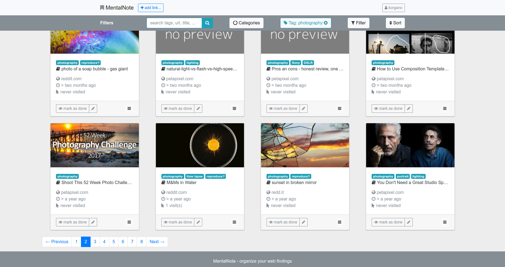

mental-note
===========

[](https://scrutinizer-ci.com/g/tolry/mental-note/?branch=master)
[](https://scrutinizer-ci.com/g/tolry/mental-note/?branch=master)
[](https://scrutinizer-ci.com/g/tolry/mental-note/build-status/master)
[](https://scrutinizer-ci.com/code-intelligence)

**work in progress**

Little web application to collect your web findings. Minimal interface.

- **categorize** what is the link intended for: read, watch, visit regularly, ...
- **tag** make your links easy to filter
- **search** simple and fast
- **mark as done** collecting lots of article links, you read once? mark them as read and be done with it
- **multi-user**
- **automatic thumbnail generation** if no thumbnail can be calculated, uses cutycapt to take a snapshot of the page

obligatory screenshot



switch to doctrine migrations
-----------------------------

if your dev installation is older than 2015-05-15 you will need to add the initial migration manually

``` bash
php app/console do:mi:version --add 20150515104913
```

running development machine
---------------------------
Prerequirements: Vagrant installed, Virtualbox installed, Ansible installed

* ```vagrant up```
* ```vagrant ssh```
* ```cd /srv/www```
* ```bin/console fo:us:cr``` (follow the steps)
* run https://mental.www/app_dev.php in browser and log in with your credentials